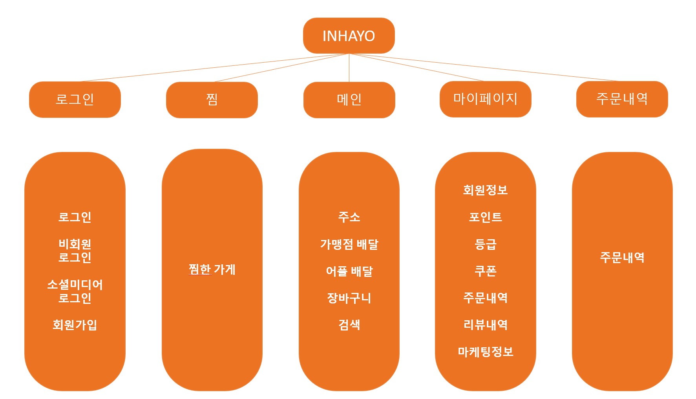
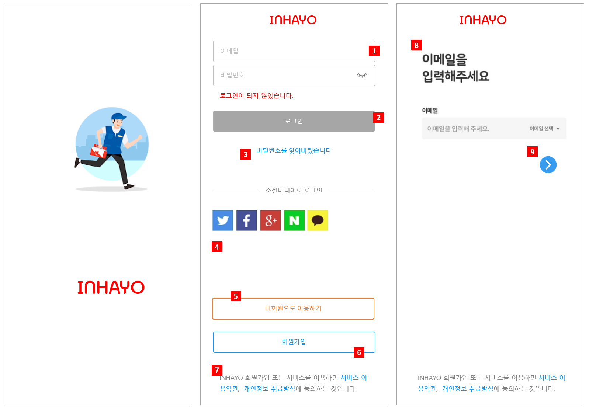
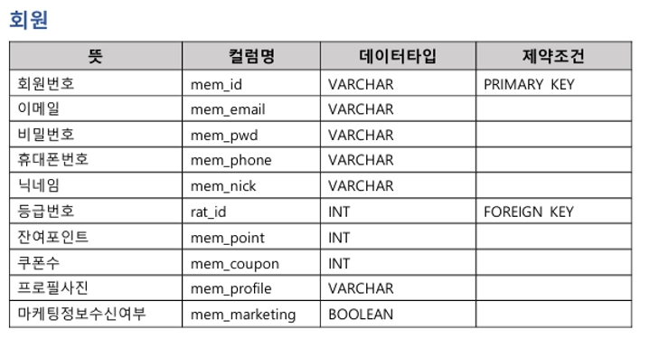
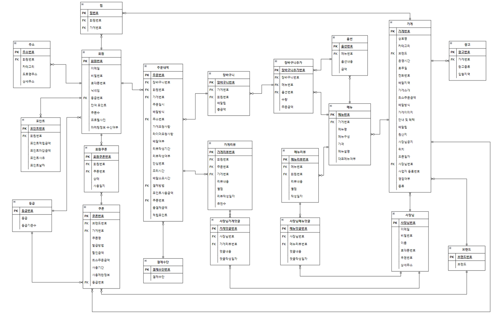
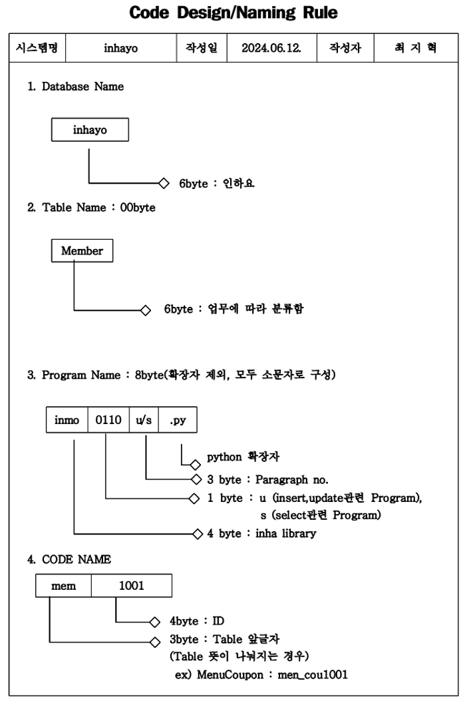
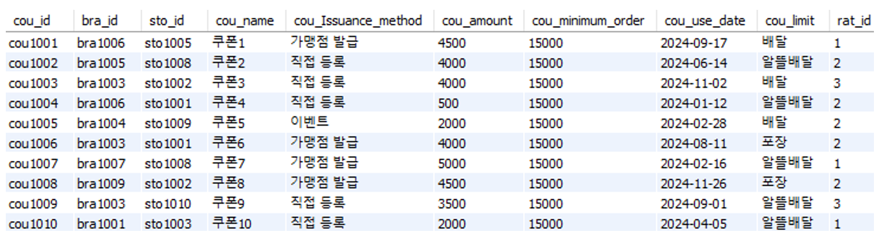

  

 

# 🍔 INHAYO Database Design

> 본 프로젝트는 배달 서비스 플랫폼 **INHAYO**의 데이터베이스 설계 및 구현을 목표로 진행되었습니다.  
> 회원, 가맹점, 주문, 리뷰, 포인트 등 배달 앱의 핵심 기능을 데이터베이스로 구조화하였습니다.

 

## 📖 프로젝트 개요
- **주제 선정 이유**: 배달 애플리케이션 서비스에서 핵심이 되는 주문·회원·가맹점 관리 체계를 체계적으로 데이터베이스로 설계하고자 함  
- **목표**: 회원, 가맹점, 주문, 리뷰, 포인트 등 주요 기능을 포함한 배달 플랫폼 데이터베이스 설계 및 구현 
- **환경**: MySQL 기반 데이터베이스 모델링, PPT 및 Word를 활용한 문서화  
- **데이터 형태**: Entity-Relationship Diagram(ERD), 테이블 정의서, 샘플 데이터

 

## 🔍 문제 정의
- 회원/비회원 모두 이용 가능
- 회원만 포인트 및 쿠폰 혜택 제공
- GPS 기반 주소 자동 저장 및 수정 가능
- 주문 내역 및 리뷰 관리 기능
- 가맹점 정보(메뉴, 배달 방식, 통계, 리뷰) 제공
- 회원 등급제 (일반, 브론즈, 실버, 골드) 운영
- 다양한 결제수단 및 포인트/쿠폰 결제 지원

 

## 🖥️ 시스템 구성도
- 로그인 / 회원가입 / 소셜 로그인 지원
- 메인 화면: 가맹점 목록, 찜, 장바구니, 검색
- 마이페이지: 회원정보, 포인트, 쿠폰, 리뷰, 주문 내역
- 업소 신청 및 광고 관리 (사장님 사이트)

 

## 📝 Storyboard
사용자 및 사장님 관점에서의 화면 흐름.

 

## 📒 Entity 기술서
주요 엔터티(Entity) 및 속성 정의:

- **회원(Member)**: 아이디, 비밀번호, 이메일, 닉네임, 포인트, 쿠폰, 주소 등  
- **가게(Store)**: 상호명, 카테고리, 배달 방식, 최소 주문 금액, 이미지, 리뷰 등  
- **주문(Order)**: 주문번호, 주문일시, 결제수단, 총 결제금액, 배달 정보 등  
- **쿠폰(Coupon)**: 쿠폰번호, 할인금액, 발급방법, 사용기간, 제한조건 등  
- **포인트(Point)**: 적립/사용 금액, 사유, 만료일자 등

 

## 🔗 ERD (Entity-Relationship Diagram)

 

## 🏷️ Naming Rule
- 테이블명: 명사 단수형 (예: `member`, `order`)  
- 컬럼명: `table_속성명` (예: `mem_id`, `ord_date`)  
- Primary Key: `id` 접미사  
- Foreign Key: 참조하는 테이블의 PK명 사용
  

 

## 📊 Sample Data
샘플 데이터 

 

## ⚙️ 사용 기술
- **DBMS**: MySQL
- **Modeling Tool**: PPT, Word 기반 정리
- **주요 개념**: 정규화, PK/FK 관계, ERD 설계

 

## 📎 참고 자료
해당 README는 요약본이며, 자세한 설계 문서 및 이미지 자료는 아래 첨부 문서에서 확인 가능합니다.

- 📄 [INHAYO_DB설계_기술서.pdf](./INHAYO_DB설계_기술서.pdf)  
- 📊 [INHAYO_DB설계.pdf](./INHAYO_DB설계.pdf)

